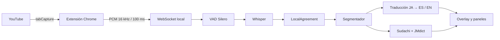

<div align="center">

# YouJP

### Subtítulos japoneses en tiempo real para YouTube

Captura el audio de la pestaña, lo transcribe localmente, lo traduce al español o inglés
y convierte cada línea en una herramienta para estudiar japonés.

<p>
  
  
  
  
  
</p>

<p>
  <a href="https://github.com/Favio520/YouJP/issues">Reportar un problema</a>
  ·
  <a href="docs/arquitectura.html">Arquitectura</a>
</p>

</div>

> [!WARNING]
> YouJP está en desarrollo activo. Actualmente está optimizado para Windows,
> Chrome/Edge y GPU NVIDIA. El audio y los modelos se procesan localmente; la
> descarga inicial de modelos y diccionarios requiere conexión a Internet.

## Qué es YouJP

YouJP es una extensión de navegador con un backend local para seguir contenido
japonés en YouTube sin depender de una pista de subtítulos existente.

El sistema muestra primero el japonés provisional, confirma las palabras cuando
la transcripción se estabiliza y añade después la traducción y el análisis
lingüístico. Puedes hacer clic en cualquier palabra para consultar su lectura,
rōmaji, categoría gramatical, conjugación y acepciones de diccionario.

La idea es sencilla: convertir cualquier vídeo japonés —noticias, entrevistas,
charlas o anime— en material de comprensión auditiva para estudiantes de nivel
JLPT N4–N3.

## Funciones

- **Subtítulos en vivo:** captura el audio de la pestaña mediante `tabCapture` y
  envía PCM mono de 16 kHz al backend por WebSocket.
- **Transcripción local:** faster-whisper con `large-v3-turbo`, VAD Silero,
  LocalAgreement y segmentación de frases.
- **Traducción japonés → español / inglés:** Qwen3-4B mediante Ollama como opción
  principal; NLLB o traducción desactivada como alternativas.
- **Análisis japonés:** Sudachi, JMdict y KANJIDIC2 para tokenización,
  lecturas, rōmaji, categorías, conjugaciones y glosas.
- **Palabras clicables:** abre una tarjeta contextual sin abandonar el vídeo.
- **Furigana configurable:** desactivada, automática o sobre todos los kanji.
- **Modo de estudio:** solo japonés, solo traducción o ambos idiomas.
- **Historial de sesión:** conserva hasta 300 frases y permite volver al momento
  exacto del vídeo con un clic.
- **Overlay configurable:** posición arrastrable, tamaño, fondo, ancho, frases
  anteriores y visibilidad del texto provisional.
- **Métricas:** latencia, RTF, uso de VRAM, descartes y estado de la conexión.
- **Privacidad local:** el flujo normal es navegador → backend local → modelos
  locales. No se necesita una API de transcripción remota.

## Cómo funciona



La extensión separa tres responsabilidades para no interrumpir el audio:

- **Service worker:** obtiene el permiso de captura y coordina los contextos.
- **Documento offscreen:** mantiene el audio, el `AudioWorklet` y el WebSocket.
- **Content script:** pinta el overlay y observa la posición del reproductor.

En el backend, el receptor WebSocket nunca espera a Whisper. El audio entra en
una cola acotada y el ASR corre en su propio hilo; los mensajes de `flush`, seek
y parada viajan por la misma cola que las tramas para conservar el orden.

## Estado actual

| Área | Estado |
|---|---|
| Banco de pruebas de streaming | ✅ Implementado |
| Captura de audio desde una pestaña | ✅ Implementado |
| Subtítulos japoneses provisionales y confirmados | ✅ Implementado |
| Traducción japonés → español / inglés | ✅ Implementado |
| Tokens clicables y tarjeta de diccionario | ✅ Implementado |
| Historial, seek y ajustes de legibilidad | ✅ Implementado |
| Gramática explicada por reglas | 🚧 Planificado |
| Explicaciones contextuales con LLM | 🚧 Planificado |
| Vocabulario, estadísticas y SRS | 🚧 Planificado |

## Rendimiento de referencia

Mediciones realizadas el 14-09-2026 sobre una RTX 2060 de 6 GB, con el modelo
`large-v3-turbo` y la GPU sin otra carga importante. Son cifras orientativas,
no una garantía para cualquier hardware.

| Tipo de audio | Latencia p50 | Latencia p95 |
|---|---:|---:|
| Narración de estudio | 1,44 s | 3,95 s |
| Entrevistas | 1,67 s | 2,67 s |
| Reportaje | 1,42 s | 2,07 s |
| Anime / acción | 1,37 s | 3,53 s |

El ASR atribuye aproximadamente 1,3 GiB de VRAM al modelo en la máquina de
referencia. La traducción local puede reducir bastante el margen disponible,
por lo que se recomienda cerrar juegos y aplicaciones que usen la GPU.

Los detalles, decisiones y resultados reproducibles están en
[`docs/adr/`](docs/adr/) y en el [documento de arquitectura](docs/arquitectura.html).

## Requisitos

### Para usar la extensión

- Windows 10 u 11.
- Chrome o Edge basado en Chromium 116 o posterior.
- GPU NVIDIA y un driver reciente para la experiencia en tiempo real.
- `uv` para el entorno Python.
- Node.js y npm para compilar la extensión.
- FFmpeg solo si quieres preparar muestras para el banco de pruebas.
- Ollama solo si quieres usar la traducción Qwen local.

La configuración probada es una RTX 2060 de 6 GB. El backend puede arrancar con
CPU y modelos pequeños, pero la latencia en directo puede ser demasiado alta.

## Instalación rápida

### 1. Clonar y preparar el backend

```powershell
git clone https://github.com/Favio520/YouJP.git
cd YouJP

.\tasks.ps1 setup
.\tasks.ps1 doctor
.\tasks.ps1 test
```

`setup` crea el entorno de `uv`, instala las bibliotecas CUDA y descarga el
modelo ASR. `doctor` muestra qué herramientas, modelos y datos faltan.

### 2. Preparar el diccionario

Este paso es opcional. Sin la base de datos, la transcripción y la traducción
siguen funcionando, pero las palabras no tendrán tarjetas de diccionario.

```powershell
cd backend
uv run python ../scripts/fetch_dicts.py
uv run python -m youjp.dict.build_db
cd ..
```

El proceso genera `data/youjp.sqlite3` con JMdict y KANJIDIC2. El archivo se
ignora en Git porque se genera localmente.

### 3. Preparar la traducción

La opción recomendada usa Qwen3-4B a través de Ollama:

```powershell
ollama pull qwen3:4b-instruct-2507-q4_K_M
```

Si tienes poca VRAM, puedes cambiar el proveedor antes de iniciar el backend:

```powershell
$env:YOUJP_MT_PROVIDER = 'nllb'   # menos VRAM, menor calidad medida
# o
$env:YOUJP_MT_PROVIDER = 'none'   # solo japonés
```

### 4. Iniciar el backend

En una terminal:

```powershell
cd backend
uv run uvicorn youjp.main:app --host 127.0.0.1 --port 8770
```

El servidor solo escucha en `127.0.0.1` por defecto.

### 5. Compilar y cargar la extensión

En otra terminal:

```powershell
cd extension
npm install
npm run build
```

Después, en Chrome o Edge:

1. Abre `chrome://extensions`.
2. Activa **Modo de desarrollador**.
3. Pulsa **Cargar descomprimida**.
4. Selecciona `extension/.output/chrome-mv3`.
5. Abre un vídeo japonés de YouTube y pulsa el icono de YouJP.

El clic en el icono es necesario: Chrome solo concede el permiso de captura
tras un gesto explícito del usuario.

## Uso

Al activar la extensión:

- el texto gris en cursiva es provisional y puede cambiar;
- el texto blanco está confirmado;
- la traducción y los tokens aparecen cuando terminan sus procesos;
- al pulsar una palabra se abre su tarjeta de análisis;
- al pulsar una frase del historial, YouTube vuelve a ese momento.

### Atajos

| Atajo | Acción |
|---|---|
| `Alt+S` | Abrir ajustes de subtítulos |
| `Alt+H` | Abrir historial de sesión |
| `Alt+M` | Abrir métricas |
| `Esc` | Cerrar un panel abierto |

### Ajustes principales

- tamaño del japonés y de la traducción;
- altura y anchura del overlay;
- fondo suave, sólido o transparente;
- número de frases anteriores;
- mostrar u ocultar texto provisional;
- furigana automática, completa o desactivada;
- idioma de destino: español o inglés;
- mostrar japonés, traducción o ambos idiomas;
- posición libre del overlay y del panel de historial.

### Cambiar entre español e inglés

Abre los ajustes con **Alt+S** (o el botón **⚙**) y selecciona **Traducir al →
Español / English**. El ajuste se guarda y se aplica a las próximas frases sin
reiniciar la captura. Las frases ya traducidas conservan su idioma en el historial,
identificadas con `ES` o `EN`; el overlay muestra la traducción del idioma elegido.
Las definiciones de JMdict también siguen esa selección. Los controles y las
etiquetas gramaticales de la interfaz siguen en español.

La selección funciona con Ollama y NLLB; con `YOUJP_MT_PROVIDER=none` la traducción
permanece desactivada. Tras actualizar esta versión, **reinicia el backend y recarga
la extensión** para que ambos extremos reconozcan el selector.

Detalles del protocolo y las decisiones de arquitectura:
[traducción multilingüe](docs/adr/0004-translation-targets.md).

## Probar sin navegador

El backend puede reproducirse con un WAV de 16 kHz mono. Esto permite depurar
ASR, segmentación, traducción y protocolo sin abrir Chrome:

```powershell
cd backend
uv run python ../scripts/replay_client.py ../bench/samples/tu-muestra.wav
uv run python ../scripts/replay_client.py ../bench/samples/tu-muestra.wav --seek-at 20
uv run python ../scripts/replay_client.py ../bench/samples/tu-muestra.wav --target en
uv run python ../scripts/check_frame_conformance.py
```

Para crear una muestra desde un vídeo local:

```powershell
.\scripts\prepare_sample.ps1 `
  -Source "D:\clips\noticias.mp4" `
  -Name noticias `
  -Duration 60
```

Para medir el pipeline:

```powershell
.\tasks.ps1 bench       # ritmo real: latencia
.\tasks.ps1 bench -Fast # sin pacing: RTF
```

Los resultados se guardan en `bench/results/`, que no se versiona.

## Configuración

Puedes copiar `.env.example` a `.env`. Todas las variables usan el prefijo
`YOUJP_` y se corresponden con los campos de `backend/youjp/config.py`.

Ejemplos habituales:

```powershell
$env:YOUJP_ASR_MODEL = 'small'
$env:YOUJP_ASR_DEVICE = 'cpu'
$env:YOUJP_ASR_COMPUTE_TYPE = 'int8'
$env:YOUJP_MIN_CHUNK_S = '0.8'
$env:YOUJP_LOG_LEVEL = 'DEBUG'
```

Para la configuración completa consulta [`.env.example`](.env.example).

## Desarrollo

### Backend

```powershell
cd backend
uv run pytest
```

### Extensión

```powershell
cd extension
npm test
npm run compile
npm run build
```

Durante el desarrollo, `npm run dev` inicia un Chrome separado con recarga en
caliente y abre YouTube automáticamente.

## Estructura del proyecto

```text
YouJP/
├── backend/
│   ├── youjp/audio/       # VAD, audio PCM y buffer circular
│   ├── youjp/asr/         # Whisper, LocalAgreement y segmentación
│   ├── youjp/dict/        # JMdict, KANJIDIC2 y base SQLite
│   ├── youjp/nlp/         # Sudachi, rōmaji y etiquetas gramaticales
│   ├── youjp/mt/          # Qwen/Ollama, NLLB y proveedor nulo
│   ├── youjp/pipeline/    # Pipeline de streaming
│   ├── youjp/ws/          # Protocolo y sesiones WebSocket
│   └── tests/             # Pruebas unitarias e integración del backend
├── extension/
│   ├── entrypoints/       # Service worker, content script y offscreen
│   ├── src/protocol.ts    # Codec binario y mensajes de servidor
│   ├── src/ui/            # Overlay, historial, ajustes y tarjetas
│   └── tests/             # Pruebas del codec de audio
├── bench/                 # Muestras y resultados locales, ignorados en Git
├── data/                  # Diccionario generado, ignorado en Git
├── docs/                  # Arquitectura y ADRs
├── models/                # Modelos descargados, ignorados en Git
├── scripts/               # Preparación, descarga y benchmarking
└── tasks.ps1              # Punto de entrada para tareas de Windows
```

## Limitaciones conocidas

- La extensión está limitada actualmente a `youtube.com`.
- Algunos sitios protegidos por DRM no exponen audio utilizable mediante
  `tabCapture`; no es un problema específico del modelo.
- El audio japonés con música, ruido o voces superpuestas puede producir más
  descartes y latencia.
- Whisper puede alucinar sobre silencio o música; el VAD es la primera barrera
  y existen filtros adicionales contra repeticiones y frases conocidas.
- ASR y traducción simultáneos pueden dejar poco margen en una GPU de 6 GB.
- No hay todavía análisis gramatical explicativo, tarjetas Anki ni repetición
  espaciada.
- El proyecto no incluye modelos, audios ni la base de datos generada; se
  descargan o construyen durante la instalación.

## Roadmap

- [x] Banco de pruebas y medición de latencia/VRAM.
- [x] Captura de audio de pestaña con Manifest V3.
- [x] Subtítulos japoneses en tiempo real.
- [x] Traducción japonés → español / inglés.
- [x] Análisis morfológico y tarjetas de palabras.
- [ ] Reglas gramaticales orientadas a N4–N3.
- [ ] Explicaciones contextuales con LLM local.
- [ ] Vocabulario guardado y exportación a Anki.
- [ ] Estadísticas de comprensión y repetición espaciada.
- [ ] Instalación simplificada para usuarios no técnicos.
- [ ] Soporte para más navegadores y plataformas.

## Contribuir

Las contribuciones son bienvenidas. Antes de abrir un cambio grande:

1. Abre un issue describiendo el problema o la propuesta.
2. Explica cómo reproducirlo, si es un bug.
3. Mantén separadas las partes de captura, ASR, traducción y UI.
4. Añade o actualiza pruebas cuando cambies el protocolo o el pipeline.
5. Ejecuta las pruebas del backend y la compilación de la extensión.

Las decisiones que afectan a la arquitectura están documentadas como ADRs en
[`docs/adr/`](docs/adr/).

## Privacidad y datos

En la configuración predeterminada, el audio de la pestaña se envía únicamente
al backend local en `127.0.0.1`. La transcripción, el análisis y la traducción
se ejecutan en la máquina del usuario. Las descargas iniciales incluyen modelos
y diccionarios; los scripts de benchmarking también pueden descargar audio de
YouTube si el usuario los ejecuta explícitamente.

No subas a Git:

- `.env` ni claves;
- modelos de Whisper, NLLB u Ollama;
- audios de terceros;
- `data/*.sqlite3`;
- resultados privados del banco de pruebas.

## Datos y licencias de terceros

Los datos de JMdict y KANJIDIC2 se descargan con los scripts del proyecto y
deben conservar sus avisos de atribución. Las bibliotecas y modelos tienen sus
propias licencias; revisa sus términos antes de redistribuir binarios o modelos.

Fuentes principales:

- [JMdict / EDRDG](https://www.edrdg.org/jmdict/j_jmdict.html)
- [KANJIDIC2 / EDRDG](https://www.edrdg.org/wiki/index.php/KANJIDIC_Project)
- [faster-whisper](https://github.com/SYSTRAN/faster-whisper)
- [SudachiPy](https://github.com/WorksApplications/SudachiPy)
- [Ollama](https://ollama.com/)

## Licencia

La licencia del proyecto se añadirá antes de la primera release pública. Hasta
que exista un archivo `LICENSE`, el código está disponible para inspección, pero
no se concede permiso automático para redistribuirlo o crear derivados.
